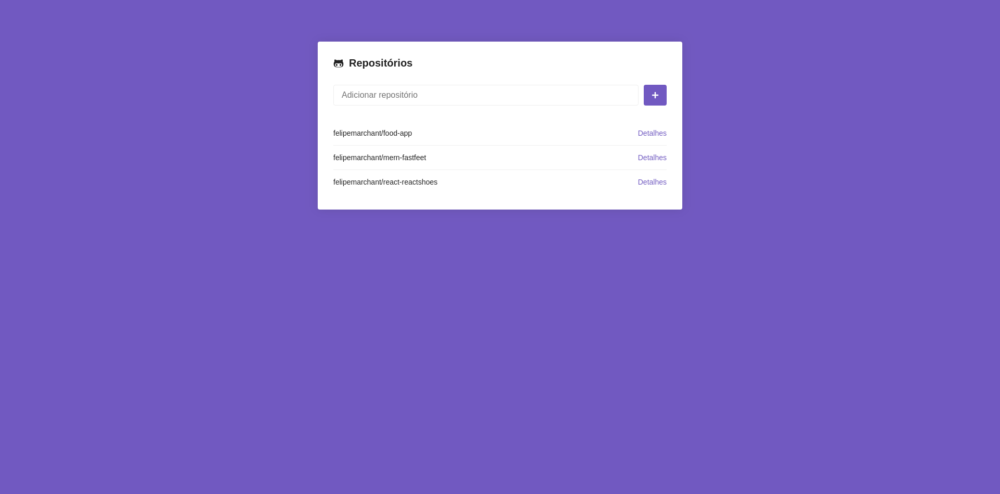

<h1 align="center">
  
</h1>

<h3 align="center">React Repo Issue - Frontend</h3>

## 💻 Projeto

React Repo Issue é uma aplicação de reports online

Essa aplicação foi desenvolvida no GoStack 9.0.

## 🚀 Instalação e execução

1. Faça um clone desse repositório;
2. Entre na pasta rodando `cd rocketshoes-mobile`;
3. Rode `yarn` para instalar as dependências;
4. Rode `yarn start` para iniciar a aplicação.

## 🤔 Como contribuir

- Faça um fork desse repositório;
- Cria uma branch com a sua feature: `git checkout -b minha-feature`;
- Faça commit das suas alterações: `git commit -m 'feat: Minha nova feature'`;
- Faça push para a sua branch: `git push origin minha-feature`.

Depois que o merge da sua pull request for feito, você pode deletar a sua branch.
